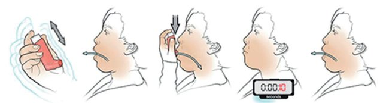
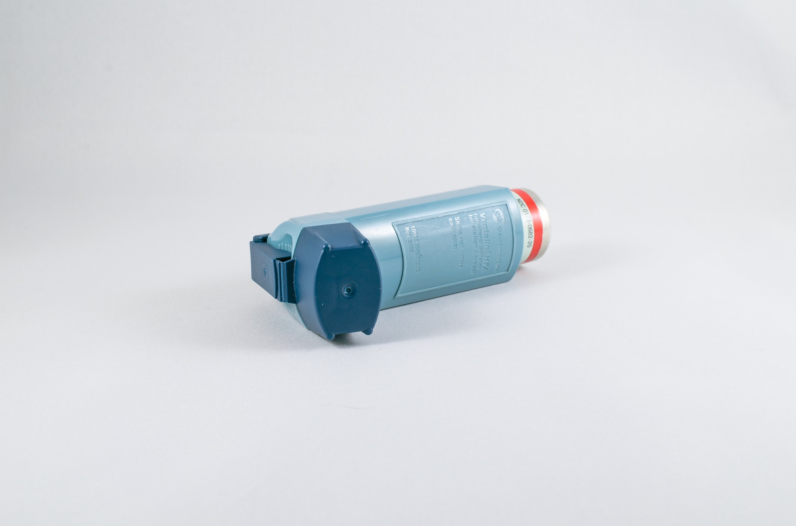
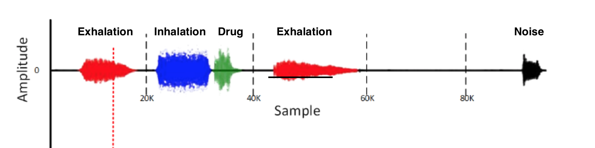
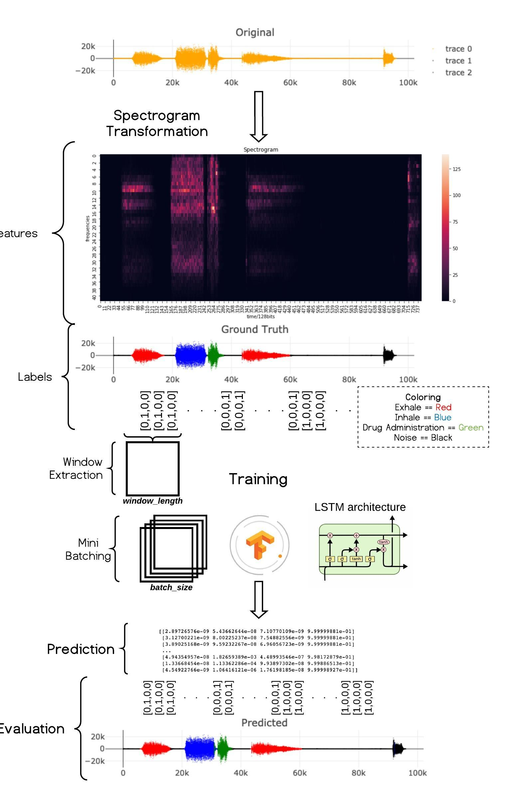

# InhaleSense

## Securing patients with deep learning from incorrect inhalatory drug administration.

### Work published in [IEEE - BIBE 2019](https://www.researchgate.net/publication/335135907_Recognition_of_breathing_activity_and_medication_adherence_using_LSTM_Neural_Networks)
---

### Motivation

I had asthma when I was a kid. I remember it being one of my most challenging experiences. **You practically feel like an astronaut in space, not certain when your air supply will run out.**

Thanks to my parents carefully providing me with the inhalers that I needed, within the years my asthma disappeared.

**But what if it happened differently?** What if I was alone? Could there be a system to ensure I would take my drug administration correctly? Whether I was a small child or a forgetful senior?

**You have to inhale with force, then keep your breath for a certain amount of time for the drug to work properly. Otherwise, zero effect.**

This essential sequence of inhalations, exhalations and click sounds that the inhaler makes when you apply the medication, can be measured and classified ineffective and non-effective administrations.

But first, you have to *discover* the actual timeframes where these events happen.

That's where Deep Learning comes in. By creating an LSTM backed pipeline, I was able to discover and label areas of inhalation, exhalation, drug administration and background noise.

The result was an almost perfect (almost perfect is better than perfect in machine learning) system that in turn can **help domain experts alarm their patients when they are misusing their medication.**

---

## Technicals

### Tech used _(keywords)_

- Deep learning
- Tensorflow/Keras/LSTM
- Python
  
### Data engineering

I started with sound files and their transformations. In order to provide with a solution that's scalable and efficient, I used only the spectrogram representation, transforming the audio file into a 2d matrix, with frequency magnitude in the y-axis and time on the x-axis.

### Data loading

As the model architecture needed to be trained to discover the label on a timestamp based on the previous sounds, I implemented a sliding by 1 step window sampling approach with as small as possible window length. The result was a generator function that could feed the network while on training and inference.

### Why Lstm?

Apart from them being an interesting enough architecture for me to want to experiment with, their internal architecture/data flow comprising of sigmoid and tahn functions, allow them to learn to forget and remember certain parts of the input. This is vital when you are dealing with time series were some parts of the sequence matter and some don't.

### Hyperparameters & Tuning

Because of the relatively low training time for the initial model I chose to perform a grid-search for the tuning of the architecture. Another approach would be to perform a fit-one-cycle technique described [here](https://sgugger.github.io/the-1cycle-policy.html) by fast.ai's [Sylvain Gugger](https://sgugger.github.io)

### Visualisations

Several ways of visualising the data were created, from spectrogram visualisation to ground truth and prediction colourization in order to provide interpretability to the results and the way the network behaves with noise.

### Output
The output of the network is a 4x1 vector containing label confidence for each time-step, as well as the accuracy of the prediction. The results could be then passed to the visualisation function in order to further validate the results.

### Data flow / Overview

You know what they say. One image === 1000 words.

---

## Takeaway

Through this experimentation process, I touched upon all aspects of data science and provided applicable innovation in the medical sector based on real world datasets. **On a personal note, it's amazing that through the things I've learned so far, I've created something that helps others in such a tangible way.**

The implementation of this project is open-sourced on [GitHub](https://github.com/deepettas/InhaleSense)

**Until next time**