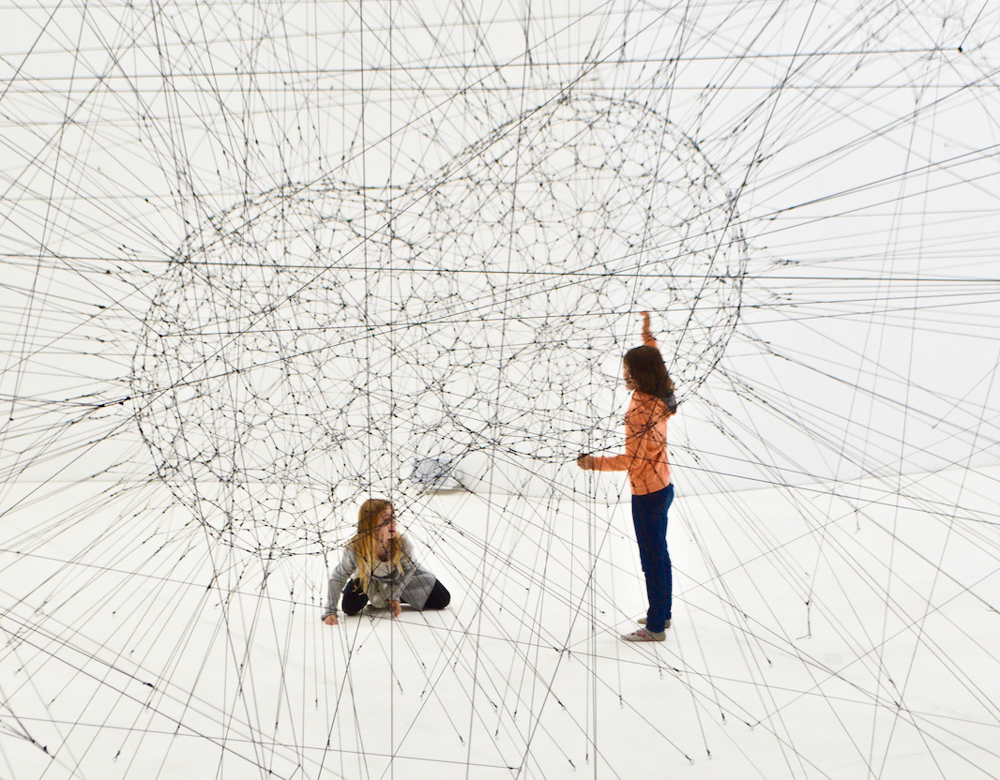

# GraphSense

Within this post you will find **3 key insights** that can extend to everyday life. My humble opinion is that these are way more important than the post itself.

Also, I will refer to networks as graphs from [graph theory](https://en.wikipedia.org/wiki/Graph_theory)
and the greek word [-Graphos](https://www.etymonline.com/word/-graph).

This is the small story of my master thesis in Computer Science, and for me at that time the pinnacle of my experience as an engineer (boy was I naive back then), so the motivation to work on something that involved data, people and intelligence is what led me this problem.

---

#### First point: We are all connected, just in different ways.

At least that's what I learned when I first read about the [Six degrees of separation](https://en.wikipedia.org/wiki/Six_degrees_of_separation) in my bachelor years.

**Everyone we know, our social structures, our biology, chemistry and markets are all represented, stored and processed as graphs.**

Gathering insights from those graphs can be invaluable. 

Moreover, detection of communities in the networks can lead to unprecedented innovation and insight in the domains.

Sadly, this task is an [NP-hard class problem](https://www.tutorialspoint.com/design_and_analysis_of_algorithms/design_and_analysis_of_algorithms_np_hard_complete_classes.htm). It can be solved iteratively, but the state of the art algorithms are computationally inefficient to a point where it's just not practical to used them in modern day scenarios where you have graphs containing billions and trillions of nodes and edges.

The task was simple, make world class community detection work for real world scenarios.

---

#### This bring us to the second point: The simplest ideas are the hardest.

Simple ideas, have fewer moving parts, hence less possibilities for conventional innovation. Fortunatelly, conventionalism is not valued in modern day society.

**In order to expand such spaces, imagination and creativity must work closely with the domain knowledge of said space.**

Back to the problem: 

Separating or even predicting communities in a graph can seem like a simple idea, until you try to innovate upon it.

A graph with no weights, edge directions and no extra features, is the simplest form representation of a connected entity structure.
 
By providing a solution in that scenario, one could then later add extra information that is inherent to a domain, augmenting but not damaging the detection algorithm itself.

You can imagine it as laying the foundations for a complex structure. If you have strong foundations, you can freely build something beautiful on them.

---

#### Question: How do you innovate in an information desert? 

#### Answer (Third point): Zero information is information on itself.

Being deprived of extra features, I focused on 
exploring the inherent and structural features that can occur for each connecting edge. By engineering novel ones, a new problem space was created.

In essence, each corresponding edge has a topology that provides information. This information is also propagated mathematically and used in the state of the art algorithms that provided the golden standard that was my target.

For a community structure to be formed, all corresponding edges that connect individuals of different communities must be "cut".

**I treated that scenario as a binary classification problem, generating a possibility for each edge to be cut or kept.**

In this way, the "expensive" algorithm's behaviour could be modeled and repeated in a different graph just by running the inference on the model which by itself scales linearly with the size of the graph.

---

## Technicals

### Tech used _(keywords)_

- Deep learning
- PySpark
- Scipy
- Python

### Data engineering

I started by downloading raw graph data. I then built a process of feature engineering and dataset creation. The resulting dataset is comprised by edge centric representation of the graph with added features as columns.

### Feature Engineering

The structure of the neighbourhood of each edge was used in order to engineer several features. Each of those features could be each generated using different lookup lengths that increase the accuracy but also the algorithmic complexity.

### Results

The algorithm achieved remarkable accuracy (~90%) in predicting the output communities of a golden standard community detection algorithm.

### Takeway

This thesis allowed me to tinker with all aspects of data science, from data loading, engineering and manipulation to feature creation, prediction and application.

***And as a bonus, all this was in a setting that effects society in a multi domain spectrum.***

***Until next time***
