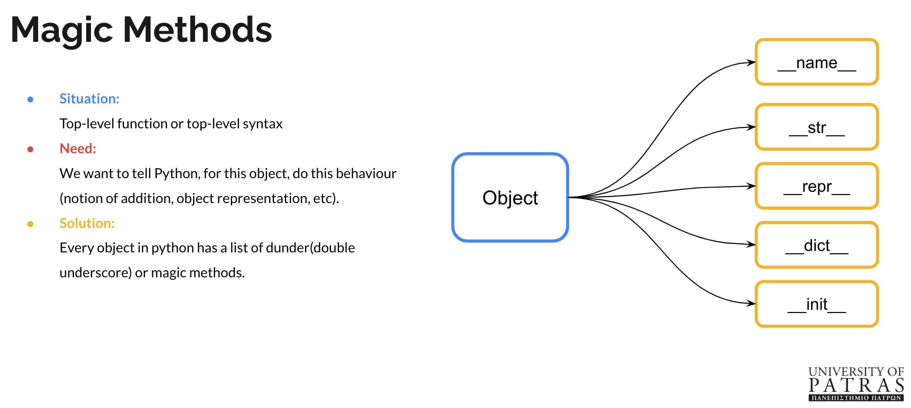

Back when I was in university, I was inspired by a Python workshop hosted by a local alumni group and a recent graduate who then worked in a [FANG type](https://www.investopedia.com/terms/f/fang-stocks-fb-amzn.asp#:~:text=In%20finance%2C%20the%20acronym%20%22FANG,%2C%20and%20Alphabet%20(GOOG).&text=FANG%20stocks%20are%20famous%20for,over%20the%20past%20five%20years) company.

When I graduated, I felt the urge to do something similar to my fellow alumni when I was confident enough that I would be able to spread a similar quality of knowledge.

As a result, I made a fun yet intense Python workshop that handled most of the intermediate concepts of the language.

Due to the recent COVID developments, the workshop was transformed into a webinar, so it an added challenge of transporting those hard to grasp concepts over a boring video stream. More on how I handled it below.

## Webinar Description:

What do we need today from a programming language? What tools are closest to our way of thought and the speed in which things are moving nowadays?

We need to construct ideas into working concepts easily especially given how fast things are unfolding around us nowadays.

Ranking top in most loved and used languages nowadays, Python is a powerful tool for almost any type of engineer. It is the magic ingredient that will help you materialize your ideas into reality. Given the right mindset and tools you can make your life as an engineer easier and more impactful. It can be categorized as an “easy to learn hard to master” subject.

## Topics:

* The Zen of Python
* Everything is an object
* Magic Methods
* Concepts & Tooling
* Comprehensions
* Decorators
* The big picture

## How to keep the audience's attention?

The hardest part with webinars is that you don't have tools like eye contact and body language to grasp the attention of the audience consistently. 

To tackle this issue, I supercharched the slides of the project with plenty of visual breaks and relative jokes:

And then follow up with a technical example:

Another example is how I tried to portray decorators:

Explained the structure visually:

Then finally with a code example:

## Results:

* Over 100 students attended.
* Multiple requests for workshops made from other students and alumni.
